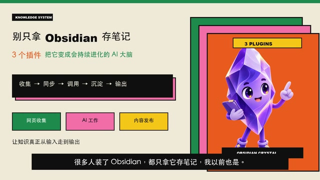
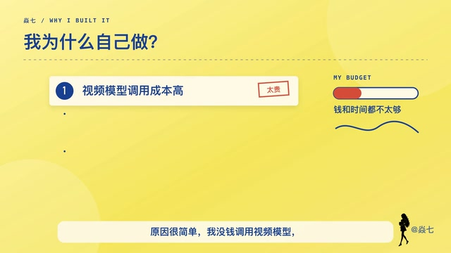

# Produce Videos：视频生成与编辑 Skill

[](https://github.com/luqi67677/produce-videos/actions/workflows/validate.yml)
[](https://github.com/luqi67677/produce-videos/releases/latest)
[](LICENSE)

> 把讲稿和真实素材交给 AI Agent，经过口播、素材、声音、分镜和整片预览确认，交付可播放、可质检、可继续修改的视频。

Produce Videos 是一套开源的视频制作 Agent Skill，适用于 Codex、Kimi Code CLI、WorkBuddy，以及其他具备本地文件读写和命令执行能力的 AI Agent。它不是一个新的剪辑软件，也不依赖视频生成模型来生成整段画面；它把内容策划、素材审片、配音、导演分镜、代码动画、剪辑和质量检查组织成一条可执行、可中断续作的制作流程。

[安装](#安装) · [开始使用](#安装后怎么使用) · [真实案例](#真实案例) · [Agent 执行入口](SKILL.md) · [版本记录](CHANGELOG.md)

An open-source video-production workflow for local AI agents, from scripts and source assets to reviewable storyboards, narration, motion, subtitles, covers, and verified final renders.

<p align="center">
  <a href="https://github.com/luqi67677/produce-videos/blob/main/examples/videos/obsidian-ai-brain.mp4"></a>
  <a href="https://github.com/luqi67677/produce-videos/blob/main/examples/videos/video-skill-v1.mp4"></a>
  <a href="https://github.com/luqi67677/produce-videos/blob/main/examples/videos/icp-filing-explainer.mp4"></a>
</p>

<p align="center"><sub>点击图片查看三个公开成片案例：软件讲解、开源工具介绍、长流程科普。</sub></p>

## 它是做什么的

当你只有一个想法、一份稿子或一批零散素材时，这套 Skill 让 Agent 先把需求问清楚，再逐步把内容变成真正可看的视频，而不是最后才发现口播、素材、声音或风格不对。

| 你可以交给它 | 它会组织 Agent 完成 | 最终可以得到 |
|---|---|---|
| 想法、讲稿、文档、PPT | 口播整理、叙事钩子、结构设计 | 确认后的完整口播与叙事契约 |
| 截图、图片、录屏、已有视频 | 素材审片、A-roll/B-roll 分工、缺口补图 | 可追溯的素材联系表与完整分镜 |
| 自己的录音、视频人声、TTS API 或本地模型 | 声音复用、模型发现、试听与完整旁白 | 已绑定版本的旁白和字幕时间轴 |
| 平台、画幅、时长和视觉方向 | 三套真实风格候选、88 套布局、平台遮挡审查 | 静态分镜、微样片、整片预览和独立封面 |
| 已确认的内容与素材 | 动画、字幕、剪辑、编码与响度质检 | 正式 MP4，以及需要时的 FCPXML 时间线 |

适合产品介绍、功能演示、教程、知识讲解、品牌宣传、作品展示和已有视频的定点修改。

它主要组合真实素材、经授权生成的静态补图、代码动画、配音和字幕。需要从纯文本生成连续真人表演、复杂运镜或电影级镜头时，应另外使用视频生成工具。

## 使用流程

| 阶段 | Agent 做什么 | 用户看到或确认什么 |
|---|---|---|
| 1. 开工 | 一次整理平台、画幅、时长、观众、口播来源、声音来源、素材、补图权限、历史参考与人物边界 | 只补充缺失信息，确认开工单 |
| 2. 内容与风格 | 建立 0—2 秒钩子、核心张力和首尾兑现关系；整理口播与真实素材；从 34 套主题中给出三套同内容真实样张 | 合并确认口播、素材和 A/B/C 风格 |
| 3. 声音 | 优先复用独立录音或视频人声；否则检查 TTS API 和本地模型，没有时再经授权推荐 Qwen3-TTS | TTS 路线先选择声音方向，再从三条同文案试听中选择 |
| 4. 完整分镜 | 审查原始素材，标记 A-roll/B-roll，匹配 88 套布局，锁定反复人物，并生成平台遮挡审查图 | 确认每句话的画面、动作、切换和素材来源 |
| 5. 动态证明 | 生成 4—8 秒代表性微样片并检查声音、运动、人物和安全区 | 普通项目检查通过后自动继续；高风险样片单独确认 |
| 6. 成片 | 生成完整低清预览，确认后再导出正式视频、独立封面和可选时间线 | 先确认整片，再拿最终文件 |

常规确认会尽量合并，减少来回等待；涉及隐私、素材授权、依赖安装、模型下载、付费调用或上传发布时，仍会单独确认。

## 安装

### 最简单的方式：直接发给你正在用的 AI

把下面这一整行复制到 **Codex、Claude Code、Cursor 或 Kimi Code CLI 的对话框**：

```text
请把这个视频 Skill 安装到你当前使用的 AI，并验证安装成功：https://github.com/luqi67677/produce-videos
```

用户不需要打开终端，也不需要选择安装平台。收到口令的 Agent 会识别自己当前运行的平台，选择对应的全局 Skill 目录，完成非交互安装并报告真实安装位置和验证结果。Agent 的执行契约见 [INSTALL_FOR_AGENTS.md](INSTALL_FOR_AGENTS.md)。

> 这里指具备本地文件读写和命令执行能力的 **Kimi Code CLI** 等本地 Agent，不是普通 Kimi 聊天网页。普通网页聊天无法替用户修改电脑文件，不能完成安装。

### WorkBuddy

打开 [GitHub Releases](https://github.com/luqi67677/produce-videos/releases/latest)，下载 `produce-videos-workbuddy.zip`，然后在“技能市场 → 添加技能 → 上传技能”中选择这个文件。

### Agent 内部怎样安装

用户无需执行下面的命令。收到安装口令后，Agent 会按自己的平台在内部运行对应命令：

| 当前 Agent | 内部非交互安装命令 |
|---|---|
| Codex | `npx skills add luqi67677/produce-videos -g -a codex -y` |
| Claude Code | `npx skills add luqi67677/produce-videos -g -a claude-code -y` |
| Cursor | `npx skills add luqi67677/produce-videos -g -a cursor -y` |
| Kimi Code CLI | `npx skills add luqi67677/produce-videos -g -a kimi-code-cli -y` |

这些命令使用开源的 [Vercel Labs Skills CLI](https://github.com/vercel-labs/skills)。`-g` 表示用户级安装，`-a` 明确当前 Agent，`-y` 跳过平台和范围选择。仓库已经对四个目标参数分别完成隔离落盘验证。

### 手动安装兜底

只有当前 Agent 无法运行 `npx` 时，才由 Agent 自己按下面的位置下载或克隆完整仓库；不应先把这些步骤交给用户。

| 平台 | 安装位置或入口 | 安装后调用 |
|---|---|---|
| Codex | `~/.codex/skills/produce-videos` | `$produce-videos` |
| Claude Code | `~/.claude/skills/produce-videos` | `/produce-videos` 或直接描述任务 |
| Cursor | `~/.cursor/skills/produce-videos` | 在 Agent 对话中直接描述任务 |
| Kimi Code CLI | `~/.config/agents/skills/produce-videos` | `/skill:produce-videos` |
| WorkBuddy | 技能市场中上传仓库生成的 ZIP | 在对话中直接描述视频任务 |

#### Codex

```bash
git clone https://github.com/luqi67677/produce-videos.git ~/.codex/skills/produce-videos
```

安装完成后重新打开会话，再输入 `$produce-videos` 使用。

#### Kimi Code CLI

```bash
git clone https://github.com/luqi67677/produce-videos.git ~/.config/agents/skills/produce-videos
```

重新打开 Kimi Code CLI 后输入 `/skill:produce-videos`。也可以直接描述视频任务，让 Agent 根据 Skill 描述自动发现。项目级安装可以放在 `.agents/skills/produce-videos`。

#### Claude Code 与 Cursor

无法运行 Skills CLI 时，Agent 分别把完整仓库克隆到 `~/.claude/skills/produce-videos` 或 `~/.cursor/skills/produce-videos`。安装完成后重新打开会话。

#### WorkBuddy

从 [GitHub Releases](https://github.com/luqi67677/produce-videos/releases/latest) 下载 `produce-videos-workbuddy.zip`，然后打开“技能市场 → 添加技能 → 上传技能”。这个安装包已经包含完整的 `SKILL.md`、`scripts`、`references` 和 `assets`。

#### 其他 Agent

如果 Agent 支持目录式 `SKILL.md`、本地文件读写和命令执行，可以把完整的 `produce-videos` 目录放入它的 Skills 目录。不能只复制 `SKILL.md`，因为声音、模板、校验和渲染流程还依赖同级的 `scripts`、`references` 和 `assets`。

平台依据：[Codex Skill 示例](https://github.com/openai/codex/blob/main/codex-rs/skills/src/assets/samples/skill-creator/SKILL.md)、[Kimi Code CLI Agent Skills](https://github.com/MoonshotAI/kimi-cli/blob/main/docs/en/customization/skills.md)、[WorkBuddy Skill 文档](https://open.workbuddy.cn/docs/skill)。

## 安装后怎么使用

最短调用方式：

```text
使用 $produce-videos，把这份讲稿和产品截图制作成一条 3:4 竖屏宣传视频。
```

Kimi Code CLI 可以这样说：

```text
/skill:produce-videos 把这段录屏制作成一条 16:9 教程视频。
```

信息比较完整时，可以一次提供：

```text
使用 produce-videos 帮我制作一条视频。

发布平台：抖音
画幅：3:4 竖屏
目标时长：60 秒以内
目标观众：第一次了解这个产品的人
想讲的内容：介绍它解决什么问题，以及怎么使用
已有素材：口播稿、产品截图和一段操作录屏
口播内容：使用我提供的稿子
最终声音：从我提供的视频中提取

如果还有缺失信息，请在开工时一次问完。
```

还不知道想做成什么样，也可以说：

```text
使用 produce-videos 帮我做一条视频。我现在只有这些资料，还没有想清楚结构、风格和声音。请先一次问清楚需要的信息，再开始制作。
```

继续昨天或上次中断的项目时：

```bash
python3 scripts/resume_project.py /path/to/video-project
```

它只读取现有审批账本和已审批文件哈希，告诉 Agent 已完成到哪里、哪些文件审批后发生了变化、下一步是什么，不创建第二套项目状态。

## 一次完整演示应该录什么

如果要向别人演示这套 Skill，可以按下面的顺序录屏。每一段都对应用户真正会经历的步骤。

| 录屏段落 | 画面 | 需要说明的重点 |
|---|---|---|
| 1. 找到仓库 | GitHub 首页和 README 第一屏 | 这是一个开源的视频制作 Agent Skill |
| 2. 安装 | 把上面的统一安装口令直接发进当前 Agent 对话框 | Agent 自己识别平台、完成安装并报告验证结果；用户不打开终端、不选择平台 |
| 3. 发起任务 | 输入“使用 produce-videos 帮我做一条视频”，同时展示已有素材 | 文字、PPT、截图、录屏、视频和音频都可以作为输入 |
| 4. 开工信息 | Agent 一次询问平台、画幅、时长、内容和声音 | 先把基础需求说清楚，减少后面返工 |
| 5. 内容方向 | 叙事契约、完整口播、真实素材联系表和三套视觉候选 | 用户确认内容与素材，并从真实样张中选择风格 |
| 6. 声音 | 已有口播直接使用，或展示三条 TTS 试听 | 会先复用现有音频、API 或本地模型，没有时才推荐开源模型 |
| 7. 分镜 | 原始素材审片计划、人物档案、完整静态分镜和平台遮挡图 | 每句话对应什么画面、怎么动、何时切换都能看见 |
| 8. 动态证明与成片 | 代表性微样片、完整低清预览、正式视频和独立封面 | 先验证真实运动，再由整片预览确认最终文件 |

录屏时不需要展示内部脚本和测试代码。观众只需要看见三件事：怎么安装、怎么把素材交给它、最后能得到什么。

## 声音与 Qwen3-TTS

Skill 会优先使用用户已经拥有的音频能力。选择 TTS 时，会先检查已配置的 API、用户明确提供的本地模型目录和标准缓存。没有可用方案时，才会推荐免费的 Qwen3-TTS，并在安装依赖或下载模型前单独取得授权。

- [Qwen3-TTS 官方项目](https://github.com/QwenLM/Qwen3-TTS)
- [Qwen3-TTS VoiceDesign 官方模型](https://huggingface.co/Qwen/Qwen3-TTS-12Hz-1.7B-VoiceDesign)
- [Apple Silicon 使用的 MLX bf16 转换版](https://huggingface.co/mlx-community/Qwen3-TTS-12Hz-1.7B-VoiceDesign-bf16)，约 4.52 GB
- [较小的 MLX 5bit 转换版](https://huggingface.co/mlx-community/Qwen3-TTS-12Hz-1.7B-VoiceDesign-5bit)，约 2.5 GB

当前内置的 Qwen 执行器面向 Apple Silicon 和 `mlx-audio`。其他设备可以使用自己的完整口播、已验证 TTS API 或兼容的本地模型。仓库不包含模型权重、预设声音、私人参考音频或 API Key。

安装 Skill 本身不会下载 TTS 模型。只有用户在视频任务中选择 Qwen 路线并明确授权后，Agent 才能安装依赖或执行下载。

## 34 套视觉主题 + 88 套布局

仓库包含 34 套视觉主题和 88 套结构化布局。主题决定颜色、字体、材质和动效语气；布局决定标题、截图、人物、图表和辅助信息放在哪里。用户没有指定视觉系统时，Skill 会评估全部 34 套主题并推荐三套真实候选；主题锁定后，每个镜头再按语义选择布局，避免临场乱摆元素。

这部分排版能力参考并引入了 [Zara Zhang 的 Frontend Slides](https://github.com/zarazhangrui/frontend-slides) 视觉模板，以及 [dreamid27/frontend-slides](https://github.com/dreamid27/frontend-slides) 扩展的 88 套布局。Produce Videos 在此基础上增加了 3:4 竖屏适配、视频分镜、平台安全区、干净度限制和成片质量门。第三方许可证与固定来源见 [THIRD_PARTY_NOTICES.md](THIRD_PARTY_NOTICES.md)。

三套候选必须使用相同标题、相同代表内容、相同主视觉和目标画幅，并直接展示：

- 3:4 封面样张；
- 与主视频一致画幅的内容样张；
- 270×360 信息流缩略图；
- 能完整看到三套候选的总览图。

选中以后，全片的封面、字幕、分镜、动画和成片都会读取同一套视觉主题，不会在后面的制作中自行换风格。

布局还带有硬限制：一个焦点、有限的辅助组与强调色、单一材质、画面占用率和最大空白区。大面积空白必须写清构图职责；脏色、噪点、随机粒子、发光 AI 大脑、漂浮图标、重色字幕条和裁切残留会直接阻止渲染。详细规则见 [视觉干净度系统](references/visual-cleanliness-system.md)。

## A-roll / B-roll 与素材补缺

A-roll 是主叙事画面，B-roll 是在同一声音主轴上切入的证据、操作演示或概念解释。B-roll 不是装饰；如果不能指出它解释的口播，就不应该出现。

素材不足时按这个顺序处理：用户真实素材 → 官方素材 → 已核验关键帧 → 经开工授权生成静态插画/信息图 → 可编辑代码动画 → 保持主画面或纯文字。Skill 不调用视频生成模型，也不使用生成图伪造产品结果、数据和真实背书。详细规则见 [A-roll、B-roll 与镜头桥接](references/roll-and-transition-system.md)。

## 叙事钩子与镜头连贯性

短视频会在开工后建立 `story-contract.json`：0—2 秒先给出可见结果、反差、真实冲突、问题或演示证据；全片只保留一条核心张力；中段每个镜头都改变信息状态；结尾必须兑现开头承诺。它学习的是叙事方法，不复制任何账号的具体文案，也不为了吸引注意编造资料无法支持的冲突。

A-roll 负责持续承载叙事主线或人格/对象锚点，B-roll 负责证明当前这句话。B-roll 切入与返回时，必须保留对象、动作、方向、形状或因果中的至少一个连续性锚点，避免画面好看但故事断掉。

## 平台安全区

Skill 内置通用横竖屏配置和抖音竖屏保守审查配置。抖音预设会重点检查顶部、底部和右侧平台控件可能遮挡的位置，并生成可关闭的 UI 遮挡审查图；这张图只用于审片，不进入最终视频。

内置比例是跨版本的保守起点，不是平台官方规范。平台界面可能变化；如果用户提供近期真机截图，Agent 应把校准值保存在当前视频项目中，并以该项目覆盖值为准。无论遮挡层开关与否，标题、首屏结果、字幕、人物面部和操作目标都必须保持安全。

## 创作记忆与人物一致性

默认记忆只保存在当前视频项目的 `creator-memory.json`，不会写入 Skill，也不会扫描或携带作者的私人项目。单次反馈先作为 `candidate`；只有用户明确同意今后继续沿用，才可以升级为 `active`。跨项目复用必须单独取得授权，项目进度仍只由审批账本推导，避免出现第二套互相冲突的状态。

需要反复出现同一人物或角色时，先建立 `character-profile-*.json`，锁定身份锚点、脸型、发型、体型、服装、色板、画风、允许变化和禁止变化。同一个 `character_id` 必须贯穿 A-roll、B-roll、封面、静态补图和动态样片；未经说明的换脸、换衣或画风漂移会阻止渲染。

## 真实案例

仓库提供三个经过授权的压缩预览：Obsidian 软件讲解、不用视频模型的视频 Skill，以及 ICP/网安备案长流程科普。见 [examples/README.md](examples/README.md)。安装包不携带案例视频，避免重复占用空间。

## 运行要求

完整执行需要：

- 能读取和写入本地文件、运行命令并直接展示图片、音频和视频的 AI Agent；
- Python 3.10 或更高版本；
- `ffmpeg` 与 `ffprobe`；
- 浏览器、Remotion、FFmpeg 或其他可完成最终画面渲染的环境。

可选能力：

- 用户自己的 TTS API；
- 已经安装的本地 TTS 模型；
- Apple Silicon 上的 `mlx-audio` 与 Qwen3-TTS。

缺少关键能力时，Agent 必须说明当前能交付到哪一步，不能把“已经读取仓库”当成“已经安装”，也不能把脚本或分镜当成最终视频。

安装后先运行只读体检：

```bash
python3 scripts/doctor.py
```

它会分别报告 Python、FFmpeg、Node/Remotion、中文字体、本地 STT、TTS API 名称和本地 Qwen 模型是否可用；不会安装依赖、下载模型或显示密钥值。

## 输出规格

- 竖屏视频：3:4、1080×1440、30fps；
- 横屏视频：16:9、1920×1080、30fps；
- 独立封面：3:4、1080×1440，同时输出 270×360 缩略图；
- 推荐视频编码：H.264；
- 推荐音频：AAC、48kHz、双声道；
- 综合响度可接受范围：-19 至 -14 LUFS，目标约 -16.5 LUFS。

生成和合成画面默认无地面、无地平线、无投射阴影、无悬浮阴影和地面反射。主体需要与背景分离时，只使用柔和、克制的轮廓光。

## 目录结构

```text
produce-videos/
├── SKILL.md                  # Agent 执行入口
├── agents/openai.yaml        # Codex 界面元数据
├── assets/                   # brief、审批、声音、分镜和主题模板
├── references/               # 制作规则、34 套视觉主题与 88 套布局
├── examples/                 # 三个公开成片案例与哈希清单
├── dist/                     # Release 安装包
├── scripts/                  # 模型发现、校验、质检和打包脚本
├── tests/                    # 自动测试
├── evals/                    # Skill 行为评估用例
├── THIRD_PARTY_NOTICES.md
└── LICENSE
```

`SKILL.md` 是 Agent 的正式执行入口。README 面向第一次接触仓库的人，负责说明能力、流程、安装和使用方式。

## 验证安装

在仓库目录运行：

```bash
python3 -m unittest discover -s tests -v
python3 scripts/validate_theme_catalog.py \
  references/frontend-slides-themes/bold-template-pack/selection-index.json
python3 scripts/validate_layout_catalog.py
python3 scripts/scan_release.py
python3 scripts/package_release.py --output-dir dist
```

验证至少应确认：

- 能读取 `SKILL.md`；
- `scripts`、`references` 和 `assets` 都存在；
- 自动测试通过；
- 34 套视觉主题和 88 套布局完整；
- 开源扫描没有发现个人路径、密钥或未经审核的二进制资产。

自动检查不能替代用户对口播、素材、声音、分镜和最终预览的实际判断，也不能证明视频已经上传、发布或产生真实用户效果。

## 隐私与安全

- 仓库不包含作者个人形象、私人音色、水印、账号资料、本机路径或用户项目素材；
- 用户提供的品牌、人物、声音和素材只属于当前视频项目，不能写回 Skill 仓库；
- API 凭证只从环境变量或系统安全存储读取，不写入聊天、项目文件或日志；
- 安装依赖、下载模型、调用付费服务和上传文件前必须单独取得用户授权；
- 发布前运行 `python3 scripts/scan_release.py` 检查本机路径、联系方式、密钥、符号链接和未经审核的二进制文件。

## 许可证

本项目使用 [MIT License](LICENSE)。第三方组件及模型说明见 [THIRD_PARTY_NOTICES.md](THIRD_PARTY_NOTICES.md)。
